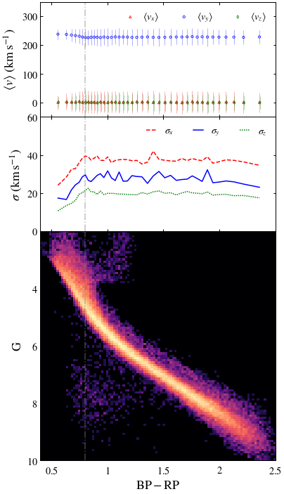
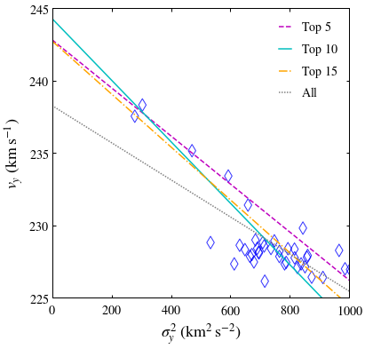
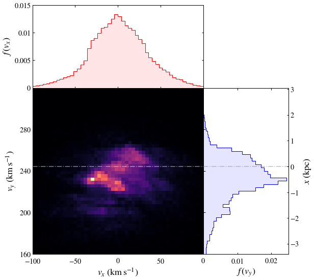

# ASTRO 533 - Project 5

**Created:** Oct. 2020   
**Last Edit:** Oct. 2020  

**Author:** Bill Chen  
**Email:** ybchen@umich.edu  

## Load packages and read data


```python
import numpy as np
import matplotlib as mpl
import matplotlib.pyplot as plt
import matplotlib.colors as mcolors
from astropy.table import Table as tb
import astropy.coordinates as coord
import astropy.units as u
from astropy.units import cds
import copy
plt.style.use('bill')

my_YlGnBu = copy.copy(mpl.cm.get_cmap('YlGnBu')) # copy the default cmap
my_YlGnBu.set_bad('w')

my_magma = copy.copy(mpl.cm.get_cmap('magma'))
my_magma.set_bad(my_magma(-1))

gaiarv_cat = tb.read('./glt13_kin.fits', format='fits')
```

## Get dynamics


```python
samp = gaiarv_cat[np.where(gaiarv_cat['parallax']>10)] # dist < 100 pc

n_samp = len(samp)
print('Number of candidates:', n_samp)
```

    Number of candidates: 65672
    


```python
dist = coord.Distance(parallax=u.Quantity(samp['parallax']))
c = coord.SkyCoord(ra=samp['ra'],
                   dec=samp['dec'],
                   distance=dist,
                   pm_ra_cosdec=samp['pmra'],
                   pm_dec=samp['pmdec'],
                   radial_velocity=samp['radial_velocity'])

coord.Galactocentric()
galcen = c.transform_to(coord.Galactocentric(z_sun=15.3*u.pc,
                                             galcen_distance=8.18*u.kpc,
                                             galcen_v_sun=coord.CartesianDifferential(np.array([11.1,250.1,7.25]),unit=u.kilometer/u.second)))

samp['d'] = 1000*u.pc*u.mas / (samp['parallax']) # distance in pc
samp['absmag'] = samp['phot_g_mean_mag'] - 5*np.log10(samp['d']/10) # absolute magnitude
```

    WARNING: AstropyDeprecationWarning: In v4.1 and later versions, the Galactocentric frame will adopt default parameters that may update with time. An updated default parameter set is already available through the astropy.coordinates.galactocentric_frame_defaults ScienceState object, as described in but the default is currently still set to the pre-v4.0 parameter defaults. The safest way to guard against changing default parameters in the future is to either (1) specify all Galactocentric frame attributes explicitly when using the frame, or (2) set the galactocentric_frame_defaults parameter set name explicitly. See http://docs.astropy.org/en/latest/coordinates/galactocentric.html for more information. [astropy.coordinates.builtin_frames.galactocentric]
    


```python
# velocities and dispersions
# bined by color

bins = 50
edges = np.linspace(0, 3, bins+1)

color = (edges[1:] + edges[:-1]) / 2
vx = np.zeros(bins)
vy = np.zeros(bins)
vz = np.zeros(bins)
sx = np.zeros(bins)
sy = np.zeros(bins)
sz = np.zeros(bins)
for i in range(bins):
    ind_temp, = np.where( (samp['bp_rp'] > edges[i]) & (samp['bp_rp'] < edges[i+1]) )
    vx[i] = np.mean(galcen[ind_temp].v_x.value)
    vy[i] = np.mean(galcen[ind_temp].v_y.value)
    vz[i] = np.mean(galcen[ind_temp].v_z.value)
    sx[i] = np.std(galcen[ind_temp].v_x.value, ddof=1)
    sy[i] = np.std(galcen[ind_temp].v_y.value, ddof=1)
    sz[i] = np.std(galcen[ind_temp].v_z.value, ddof=1)
```

    c:\users\bill\appdata\local\programs\python\python36\lib\site-packages\numpy\core\fromnumeric.py:3373: RuntimeWarning: Mean of empty slice.
      out=out, **kwargs)
    c:\users\bill\appdata\local\programs\python\python36\lib\site-packages\numpy\core\_methods.py:170: RuntimeWarning: invalid value encountered in double_scalars
      ret = ret.dtype.type(ret / rcount)
    c:\users\bill\appdata\local\programs\python\python36\lib\site-packages\numpy\core\_methods.py:234: RuntimeWarning: Degrees of freedom <= 0 for slice
      keepdims=keepdims)
    c:\users\bill\appdata\local\programs\python\python36\lib\site-packages\numpy\core\_methods.py:195: RuntimeWarning: invalid value encountered in true_divide
      arrmean, rcount, out=arrmean, casting='unsafe', subok=False)
    c:\users\bill\appdata\local\programs\python\python36\lib\site-packages\numpy\core\_methods.py:226: RuntimeWarning: invalid value encountered in double_scalars
      ret = ret.dtype.type(ret / rcount)
    


```python
# velocities and dispersions
# bined by number

bins = 40
edges = np.linspace(0, n_samp-1, bins+1)
edges = edges.astype(np.int)

ind_color = np.argsort(samp['bp_rp'])

color = np.zeros(bins)
vx = np.zeros(bins)
vy = np.zeros(bins)
vz = np.zeros(bins)
sx = np.zeros(bins)
sy = np.zeros(bins)
sz = np.zeros(bins)

for i in range(bins):
    color[i] = np.mean(samp['bp_rp'][ind_color[edges[i]:edges[i+1]]])
    vx[i] = np.mean(galcen[ind_color[edges[i]:edges[i+1]]].v_x.value)
    vy[i] = np.mean(galcen[ind_color[edges[i]:edges[i+1]]].v_y.value)
    vz[i] = np.mean(galcen[ind_color[edges[i]:edges[i+1]]].v_z.value)
    sx[i] = np.std(galcen[ind_color[edges[i]:edges[i+1]]].v_x.value, ddof=1)
    sy[i] = np.std(galcen[ind_color[edges[i]:edges[i+1]]].v_y.value, ddof=1)
    sz[i] = np.std(galcen[ind_color[edges[i]:edges[i+1]]].v_z.value, ddof=1)
```

## CMD


```python
# plot parameters
x_min, x_max = 0.4, 2.5
y_min, y_max = 2, 10

# plot
# fig, [ax2,ax1] = plt.subplots(2, 1, figsize=(6,12), sharex=True)

fig = plt.figure(figsize=(6,12))
ax1 = plt.subplot2grid((4, 1), (2, 0), rowspan=2)
ax2 = plt.subplot2grid((4, 1), (0, 0))
ax3 = plt.subplot2grid((4, 1), (1, 0))
fig.subplots_adjust(hspace=0)

ax1.axvline(0.8, c='gray', ls='-.', alpha=0.5)
ax1.hist2d(samp['bp_rp'], samp['absmag'], range=[[x_min, x_max], [y_min, y_max]],
          bins = 100, norm=mcolors.LogNorm(), cmap=my_magma)

ax1.set_xlabel(r'$\mathrm{BP-RP}$')
ax1.set_ylabel(r'$\mathrm{G}$')
ax1.set_xlim(x_min, x_max)
ax1.set_ylim(y_max, y_min)
ax1.set_xticks([0.5, 1, 1.5, 2, 2.5])
ax1.set_xticklabels([r'$0.5$', r'$1$', r'$1.5$', r'$2$', r'$2.5$'])
ax1.set_yticks([2, 4, 6, 8, 10])
ax1.set_yticklabels(['', r'$4$', r'$6$', r'$8$', r'$10$'])

# velocity
ax2.axvline(0.8, c='gray', ls='-.', alpha=0.5)

# errorbar style
ax2.scatter(color, vx, marker='^', edgecolors='r', facecolor='', alpha=0.8, s=10, label=r'$\left<v_x\right>$')
ax2.scatter(color, vy, marker='o', edgecolors='b', facecolor='', alpha=0.8, s=10, label=r'$\left<v_y\right>$')
ax2.scatter(color+0.005, vz, marker='d', edgecolors='g', facecolor='', alpha=0.8, s=10, label=r'$\left<v_z\right>$')

ax2.errorbar(color, vx, sx, c='r', fmt='none', alpha=0.3, lw=1, label=None)
ax2.errorbar(color, vy, sy, c='b', fmt='none', alpha=0.3, lw=1, label=None)
ax2.errorbar(color+0.005, vz, sy, c='g', fmt='none', alpha=0.3, lw=1, label=None)

# shade style
# ax2.plot(color, vx, c='r', ls='--', label=r'$\left<v_x\right>$')
# ax2.plot(color, vy, c='b', ls='-', label=r'$\left<v_y\right>$')
# ax2.plot(color, vz, c='g', ls=(0,(1,1)), label=r'$\left<v_z\right>$')

# ax2.fill_between(color, vx-sx, vx+sx, alpha = 0.3, facecolor='r', edgecolor=None, label=None)
# ax2.fill_between(color, vy-sy, vy+sy, alpha = 0.3, facecolor='b', edgecolor=None, label=None)
# ax2.fill_between(color, vz-sz, vz+sz, alpha = 0.3, facecolor='g', edgecolor=None, label=None)

ax2.set_ylabel(r'$\left<v\right>\ (\mathrm{km\,s^{-1}})$')
ax2.set_xlim(x_min, x_max)
ax2.set_ylim(-50, 350)
ax2.set_xticks([0.5, 1, 1.5, 2, 2.5])
ax2.set_xticklabels([])
ax2.set_yticks([0, 100, 200, 300])
ax2.set_yticklabels([r'$0$', r'$100$', r'$200$', r'$300$'])
ax2.legend(ncol=3, loc=1)

# dispersion
ax3.axvline(0.8, c='gray', ls='-.', alpha=0.5)

ax3.plot(color, sx, c='r', ls='--', label=r'$\sigma_x$')
ax3.plot(color, sy, c='b', ls='-', label=r'$\sigma_y$')
ax3.plot(color, sz, c='g', ls=(0,(1,1)), label=r'$\sigma_z$')

ax3.set_ylabel(r'$\sigma\ (\mathrm{km\,s^{-1}})$')
ax3.set_xlim(x_min, x_max)
ax3.set_ylim(0, 60)
ax3.set_xticks([0.5, 1, 1.5, 2, 2.5])
ax3.set_xticklabels([])
ax3.set_yticks([0, 20, 40, 60])
ax3.set_yticklabels([r'$0$', r'$20$', r'$40$', r'$60$'])
ax3.legend(ncol=3, loc=1)

plt.savefig('./figures/cmd.pdf')
plt.show()
```





## $v$-$s^2$ relation


```python
fig, ax = plt.subplots(figsize=(6,6))

ax.scatter(sy**2, vy, marker='d', edgecolors='b', facecolor='', alpha=0.8, s=100)
p10 = np.poly1d(np.polyfit(sy[:10]**2, vy[:10], 1))
p5 = np.poly1d(np.polyfit(sy[:5]**2, vy[:5], 1))
p15 = np.poly1d(np.polyfit(sy[:15]**2, vy[:15], 1))
pall = np.poly1d(np.polyfit(sy**2, vy, 1))
ax.plot([0, 1000], [p5(0), p5(1000)], c='m', ls='--', label=r'$\mathrm{Top\ 5}$')
ax.plot([0, 1000], [p10(0), p10(1000)], c='c', ls='-', label=r'$\mathrm{Top\ 10}$')
ax.plot([0, 1000], [p15(0), p15(1000)], c='orange', ls='-.', label=r'$\mathrm{Top\ 15}$')
ax.plot([0, 1000], [pall(0), pall(1000)], c='gray', ls=(0,(1,1)), label=r'$\mathrm{All}$')

ax.set_xlabel(r'$\sigma_y^2\ (\mathrm{km^2\,s^{-2}})$')
ax.set_ylabel(r'$v_y\ (\mathrm{km\,s^{-1}})$')
ax.set_xlim(0, 1000)
ax.set_ylim(225, 245)
ax.set_xticks([0, 200, 400, 600, 800, 1000])
ax.set_xticklabels([r'$0$', r'$200$', r'$400$', r'$600$', r'$800$', r'$1000$'])
ax.set_yticks([225, 230, 235, 240, 245])
ax.set_yticklabels([r'$225$', r'$230$', r'$235$', r'$240$', r'$245$'])
ax.legend()

plt.savefig('./figures/v_s.pdf')
plt.show()
```





```python
vc = p10(0) * u.km / u.s
print('estimated vc: ', vc)

R0 = 8.18 * u.kpc
M_R0 = vc**2 * R0 / cds.G
print('enclosed mass: ', M_R0.to(cds.Msun))
```

    estimated vc:  244.2860285312157 km / s
    enclosed mass:  113498330403.57202 Msun
    

## $v_y$-$x$ relation


```python
fig = plt.figure(figsize=(9,9))
ax1 = plt.subplot2grid((3, 3), (1, 0), rowspan=2, colspan=2)
ax2 = plt.subplot2grid((3, 3), (0, 0), colspan=2)
ax3 = plt.subplot2grid((3, 3), (1, 2), rowspan=2)
fig.subplots_adjust(hspace=0, wspace=0)

# ax1.hist2d(galcen.v_x.value, galcen.v_y.value, range=[[-200, 200], [50, 350]],
#            bins=50, norm=mcolors.LogNorm(), cmap=my_YlGnBu)
ax1.hist2d(galcen.v_x.value, galcen.v_y.value, range=[[-100, 100], [160, 320]],
           bins=50, cmap=my_magma)

ax1.axhline(vc, c='w', ls='-.', alpha=0.5)

ax1.set_xlabel(r'$v_x\ (\mathrm{km\,s^{-1}})$')
ax1.set_ylabel(r'$v_y\ (\mathrm{km\,s^{-1}})$')
ax1.set_xlim(-100, 100)
ax1.set_ylim(160, 320)
ax1.set_xticks([-100, -50, 0, 50, 100])
ax1.set_xticklabels([r'$-100$', r'$-50$', r'$0$', r'$50$', ''])
ax1.set_yticks([160, 200, 240, 280, 320])
ax1.set_yticklabels([r'$160$', r'$200$', r'$240$', r'$280$', ''])

# f(vx)
ax2.hist(galcen.v_x.value, bins=50, range=[-100, 100], density=True, orientation='vertical', histtype='stepfilled',
         color='r', alpha=0.1, label=None)
ax2.hist(galcen.v_x.value, bins=50, range=[-100, 100], density=True, orientation='vertical', histtype='step',
         linewidth=1, color='r', label=None)

ax2.set_ylabel(r'$f\,(v_x)$')

ax2.set_xlim(-100, 100)
ax2.set_ylim(0, 0.015)
ax2.set_xticks([-100, -50, 0, 50, 100])
ax2.set_xticklabels([])
ax2.set_yticks([0, 0.005, 0.01, 0.015])
ax2.set_yticklabels([r'$0$', r'$0.005$', r'$0.01$', r'$0.015$'])

# f(vy)
ax3.hist(galcen.v_y.value, bins=50, range=[160, 320], density=True, orientation='horizontal', histtype='stepfilled',
         color='b', alpha=0.1, label=None)
ax3.hist(galcen.v_y.value, bins=50, range=[160, 320], density=True, orientation='horizontal', histtype='step',
         linewidth=1, color='b', label=None)

ax3.axhline(vc, c='gray', ls='-.', alpha=0.5)

ax3.set_xlabel(r'$f\,(v_y)$')
ax3.set_xlim(0, 0.025)
ax3.set_ylim(160, 320)
ax3.set_xticks([0, 0.01, 0.02])
ax3.set_xticklabels([r'$0$', r'$0.01$', r'$0.02$'])
ax3.set_yticks([160, 200, 240, 280, 320])
ax3.set_yticklabels([])

B = 12.4
secax3 = ax3.twinx()
secax3.set_ylabel(r'$x\ (\mathrm{kpc})$')
secax3.set_ylim((160-vc)/B/2, (320-vc)/B/2)
secax3.set_yticks([-3, -2, -1, 0, 1, 2, 3])
secax3.set_yticklabels([r'$-3$', r'$-2$', r'$-1$', r'$0$', r'$1$', r'$2$', r'$3$'])

plt.savefig('./figures/v_v.pdf')
plt.show()
```





```python

```
